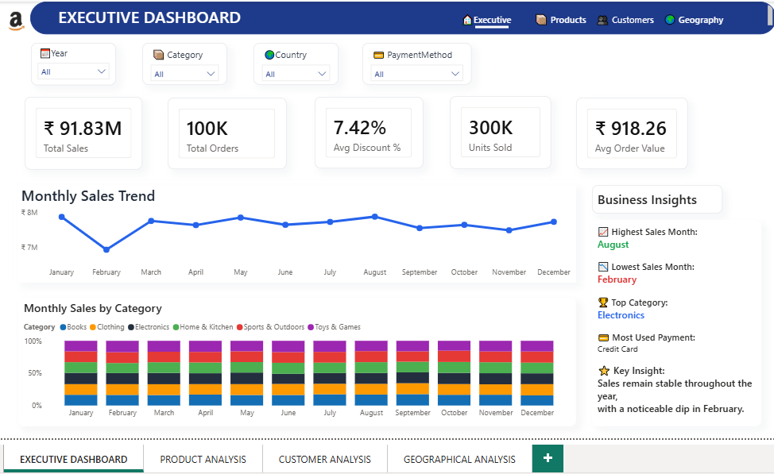
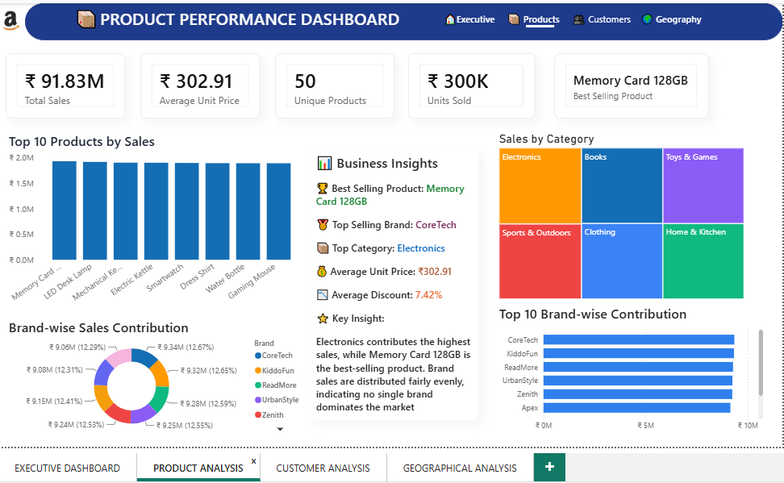
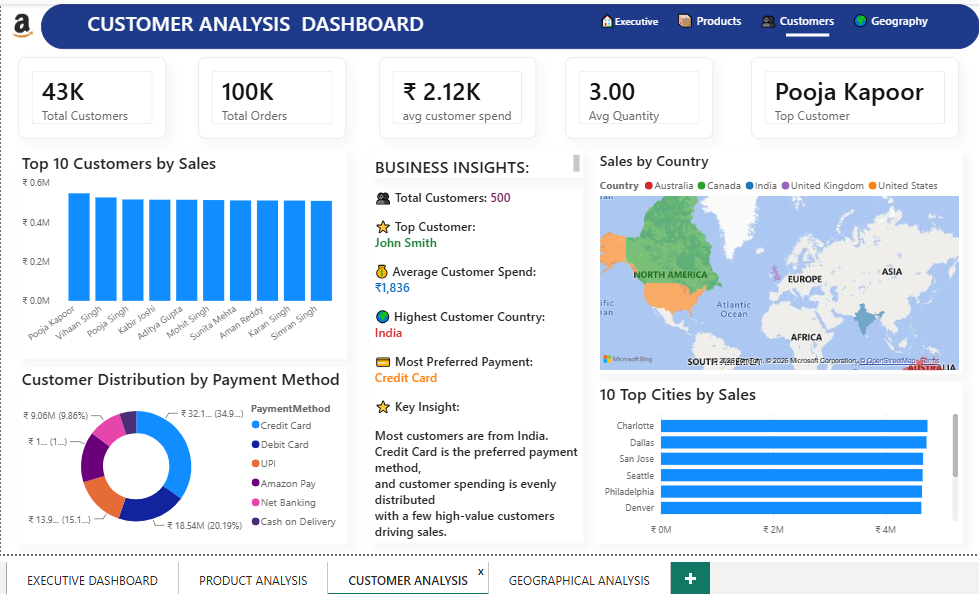
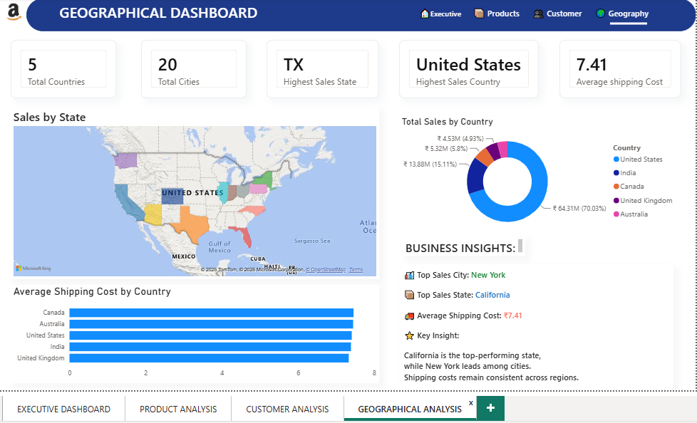

    <h1>📊 Amazon Sales Analytics</h1>
    
From Raw Data to Actionable Insights

    🎨 Power BI Dashboard
    🐍 Python Analysis
    🗄️ SQL Queries

    <h2>🌟 About This Project</h2>
    
This repository presents a <strong>complete Amazon sales analytics journey</strong> built around data cleaning, exploratory analysis, SQL-based querying, and an interactive Power BI dashboard. It is designed to showcase professional data analysis techniques and business intelligence best practices.

    
    
The project focuses on understanding:

    <ul class="feature-list">
        <li>Revenue trends and performance metrics</li>
        <li>Customer behavior and purchasing patterns</li>
        <li>Product performance and category insights</li>
        <li>Geographic sales distribution</li>
        <li>Shipping efficiency and payment preferences</li>
    </ul>

    <h2>🎯 Core Objectives</h2>
    <ul class="feature-list">
        <li>Analyze total sales and revenue performance</li>
        <li>Identify high-performing products and categories</li>
        <li>Understand customer purchasing patterns</li>
        <li>Examine regional and market-level sales trends</li>
        <li>Review payment preferences and shipping behavior</li>
        <li>Create an executive-style dashboard for quick decision-making</li>
    </ul>

    <h2>🛠️ Tools & Technologies</h2>
    <table class="tools-table">
        <thead>
            <tr>
                <th>Tool</th>
                <th>Role</th>
            </tr>
        </thead>
        <tbody>
            <tr>
                <td><strong>Python</strong></td>
                <td>Data cleaning, preprocessing, and exploratory analysis</td>
            </tr>
            <tr>
                <td><strong>SQL</strong></td>
                <td>Querying and business logic implementation</td>
            </tr>
            <tr>
                <td><strong>Power BI</strong></td>
                <td>Dashboard design and interactive reporting</td>
            </tr>
            <tr>
                <td><strong>DAX</strong></td>
                <td>KPI calculations and custom measures</td>
            </tr>
            <tr>
                <td><strong>Power Query</strong></td>
                <td>Data transformation and shaping</td>
            </tr>
        </tbody>
    </table>

    <h2>🔄 Workflow Pipeline</h2>
    

        <strong>Raw Amazon Dataset</strong> → <strong>Python Cleaning</strong> → <strong>EDA</strong> → <strong>SQL Queries</strong> → <strong>Power BI Measures</strong> → <strong>Interactive Dashboard</strong> → <strong>Actionable Insights</strong>
    

    <h2>📊 Dashboard Highlights</h2>
    

        <strong>✨ Interactive Features:</strong>
    

    <ul class="feature-list">
        <li>Executive overview of sales performance with KPIs</li>
        <li>Product and category performance analysis</li>
        <li>Customer segmentation and purchase behavior</li>
        <li>Regional sales insights by geography</li>
        <li>Shipping and payment analysis for operational understanding</li>
    </ul>

    <h2>📸 Preview Gallery</h2>
    

        

            
            
Executive Summary

        

        

            
            
Product Performance

        

        

            
            
Customer Analysis

        

        

            
            
Geographic Insights

        

    

    <h2>📁 Project Structure</h2>
    

Amazon-Sales-Analytics/ 
├── 📄 Amazon.csv 
├── 📓 Amazon_data_cleaning.ipynb 
├── 🔍 amazon_sql.sql 
├── 📊 Amazon Sales DAX.pbix 
├── 🖼️ EXECUTIVE.png 
├── 🖼️ PRODUCT.png 
├── 🖼️ CUSTOMERS.png 
├── 🖼️ GEOGRAPHY.png 
├── 📋 LICENSE 
└── 📖 README.md
    

    <h2>💡 Business Value</h2>
    
This project helps turn large volumes of e-commerce data into understandable metrics and visuals that support:

    <ul class="feature-list">
        <li>Better sales decisions and strategic planning</li>
        <li>Performance tracking and KPI monitoring</li>
        <li>Identification of market opportunities</li>
        <li>Customer insights and behavior understanding</li>
        <li>Operational efficiency improvements</li>
    </ul>

    <h2>🚀 How to Explore</h2>
    <ol style="padding-left: 20px; line-height: 1.8;">
        <li>📓 Open the <strong>notebook</strong> for the complete analysis workflow</li>
        <li>🔍 Review the <strong>SQL file</strong> for business queries and logic</li>
        <li>📊 Open the <strong>Power BI file</strong> for interactive exploration</li>
        <li>🖼️ Check the <strong>screenshots</strong> for quick visual summary</li>
    </ol>

    <h2>⭐ Why It Stands Out</h2>
    

        It combines <strong>analytical depth</strong>, <strong>storytelling</strong>, and <strong>visualization</strong> in a way that is ideal for resumes, portfolios, internships, and analytics interviews.
    

    
🎓 Built with Passion for Data Analysis

    

        Python
        SQL
        Power BI
    

    
Crafted for data-driven decision making

