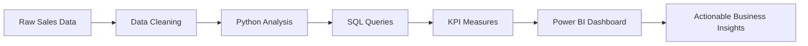

<div align="center">


<br>


<br>


</div>

---

# ✨ Project Overview

This project turns Amazon sales data into a polished business intelligence experience using Python, SQL, and Power BI. It highlights revenue performance, customer behavior, product demand, regional trends, and shipping efficiency in one interactive dashboard.

The goal is to make complex sales data easy to understand for executives, marketers, and analysts through clear visual storytelling and measurable KPIs.

---

## 🚀 What This Dashboard Delivers

- Real-time-style executive visibility for sales performance
- Deep analysis of top products, categories, and customers
- Geographic insight into high-performing regions and cities
- Payment and shipping behavior analysis
- A modern Power BI dashboard designed for decision-making

---

## 🎯 Business Questions Addressed

- Which products generate the highest revenue?
- Which categories and brands perform best?
- What are the monthly sales trends?
- Which payment methods are most commonly used?
- Which regions contribute the most sales?
- What is the average shipping cost and how does it impact profitability?
- Which customers contribute maximum revenue?
- What are the most important sales KPIs at a glance?

---

## 🛠 Technology Stack

| Tool | Purpose |
|------|---------|
| 🐍 Python | Data cleaning, exploration, and analysis |
| 🗄 SQL | Querying and business logic |
| 📊 Power BI | Interactive dashboard and visualization |
| ⚡ DAX | KPI calculations and measures |
| 🔄 Power Query | Data transformation |
| 📁 CSV / Excel | Input dataset format |

---

## 🔄 Analytics Workflow



---

## 📊 Key KPIs Covered

| KPI | Focus Area |
|-----|------------|
| Revenue | Overall business health |
| Orders | Sales activity |
| Quantity Sold | Product demand |
| Average Order Value | Purchase behavior |
| Shipping Cost | Logistics efficiency |
| Payment Method | Customer preferences |
| Regional Sales | Market performance |
| Top Products | Product success |

---

## 📸 Dashboard Preview

### Executive Overview


### Product Performance


### Customer Insights


### Regional Sales


---

## 📂 Project Structure

```text
Amazon-Sales-Analytics-Dashboard/
├── Amazon.csv
├── Amazon_data_cleaning.ipynb
├── amazon_sql.sql
├── Amazon Sales DAX.pbix
├── EXECUTIVE.png
├── PRODUCT.png
├── CUSTOMERS.png
├── GEOGRAPHY.png
├── LICENSE
├── README.md
```

---

## 💡 Key Insights

- Identified top-performing products and categories
- Evaluated customer purchase behavior
- Compared regional sales performance
- Analyzed payment preferences and shipping cost impact
- Built a dashboard suitable for executive reporting and business review

---

## 🚀 How to Use

1. Open the notebook file to explore the analysis workflow.
2. Review the SQL queries for business logic and reporting logic.
3. Open the Power BI file to interact with the dashboard.
4. Use the screenshots and visuals as a reference for presentation or portfolio sharing.

---

## ⭐ Why This Project Stands Out

This project combines analytical thinking, data storytelling, and dashboard design in a format that is ideal for portfolios, internships, and business analytics roles.

<div align="center">

### Built with passion for data-driven decision making


</div>
